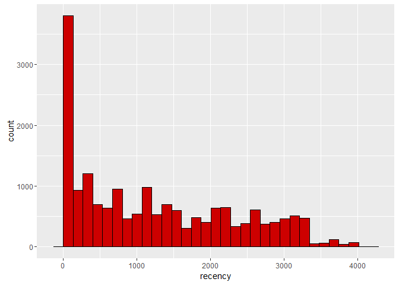

# Module 1 - Statistical segmentation
Nicolas  
April 18, 2016  

### Loading the dataset

```r
data <- read.delim(file = 'purchases.txt', header = FALSE, sep = '\t', dec = '.')
```

### Transforming the dataset

Let's add headers and interpret the last column as a date, extract year of purchase

```r
colnames(data) <- c('customer_id', 'purchase_amount', 'date_of_purchase')
data$date_of_purchase <- as.Date(data$date_of_purchase, "%Y-%m-%d")
data$days_since       <- as.numeric(difftime(time1 = "2016-01-01",
                                            time2 = data$date_of_purchase,
                                            units = "days"))
```

### Exploring the transformed dataset

```r
head(data)
```

```
##   customer_id purchase_amount date_of_purchase days_since
## 1         760              25       2009-11-06  2246.9583
## 2         860              50       2012-09-28  1189.9583
## 3        1200             100       2005-10-25  3719.9583
## 4        1420              50       2009-07-09  2366.9583
## 5        1940              70       2013-01-25  1070.9583
## 6        1960              40       2013-10-29   793.9583
```

```r
summary(data)
```

```
##   customer_id     purchase_amount   date_of_purchase    
##  Min.   :    10   Min.   :   5.00   Min.   :2005-01-02  
##  1st Qu.: 57720   1st Qu.:  25.00   1st Qu.:2009-01-17  
##  Median :102440   Median :  30.00   Median :2011-11-23  
##  Mean   :108935   Mean   :  62.34   Mean   :2011-07-14  
##  3rd Qu.:160525   3rd Qu.:  60.00   3rd Qu.:2013-12-29  
##  Max.   :264200   Max.   :4500.00   Max.   :2015-12-31  
##    days_since      
##  Min.   :   0.958  
##  1st Qu.: 732.958  
##  Median :1499.958  
##  Mean   :1631.898  
##  3rd Qu.:2539.958  
##  Max.   :4015.958
```


### Computing key marketing indicators

Let's compute key marketing indicators: Recency, Frequency, and Monetary Value (average purchase amount):

```r
library(dplyr)

customer_id_groups <- group_by(data, customer_id)     # first groups data by customer_id

customers <- summarise(customer_id_groups,  # then summarizes and creates new variables 
                       recency = min(days_since),     # number of days since last purchase
                       frequency = n(),                # number of purchases
                       amount = mean(purchase_amount))  # average purchase amount (monetary value)

head(customers)
```

```
## Source: local data frame [6 x 4]
## 
##   customer_id   recency frequency    amount
##         (int)     (dbl)     (int)     (dbl)
## 1          10 3828.9583         1  30.00000
## 2          80  342.9583         7  71.42857
## 3          90  757.9583        10 115.80000
## 4         120 1400.9583         1  20.00000
## 5         130 2969.9583         2  50.00000
## 6         160 2962.9583         2  30.00000
```

```r
summary(customers)
```

```
##   customer_id        recency           frequency          amount       
##  Min.   :    10   Min.   :   0.958   Min.   : 1.000   Min.   :   5.00  
##  1st Qu.: 81990   1st Qu.: 243.958   1st Qu.: 1.000   1st Qu.:  21.67  
##  Median :136430   Median :1069.958   Median : 2.000   Median :  30.00  
##  Mean   :137574   Mean   :1252.996   Mean   : 2.782   Mean   :  57.79  
##  3rd Qu.:195100   3rd Qu.:2129.958   3rd Qu.: 3.000   3rd Qu.:  50.00  
##  Max.   :264200   Max.   :4013.958   Max.   :45.000   Max.   :4500.00
```

### Doing more data exploration


```r
library(ggplot2)

ggplot(data=customers, aes(recency)) + geom_histogram(color = I('black'), fill= I('red3'))
```




```r
ggplot(data=customers, aes(frequency)) + geom_histogram(color = I('black'), fill= I('orange'))
```


```r
ggplot(data=customers, aes(amount)) + geom_histogram(binwidth = 10, color = I('black'), fill= I('deepskyblue')) +
   scale_x_continuous(limits = c(0, 500),
                     breaks = seq(0, 500, 20))
```


The frequency and monetary value distribution are skewed. It requires data transformation (log).

***

## Preparing and transforming the dataset for hierarchical clustering

### Copying customer data into new data frame

```r
customers_transformed <- customers
```

### Removing customer_id as a variable
And storing it as row names:

```r
row.names(customers_transformed) <- customers_transformed$customer_id
customers_transformed$customer_id <- NULL
head(customers_transformed)
```

```
## Source: local data frame [6 x 3]
## 
##     recency frequency    amount
##       (dbl)     (int)     (dbl)
## 1 3828.9583         1  30.00000
## 2  342.9583         7  71.42857
## 3  757.9583        10 115.80000
## 4 1400.9583         1  20.00000
## 5 2969.9583         2  50.00000
## 6 2962.9583         2  30.00000
```

### Taking the log-transform of the amount

```r
customers_transformed$amount <- log(customers_transformed$amount)

ggplot(data=customers_transformed, aes(amount)) + geom_histogram(binwidth = 0.4) +
  scale_x_continuous(limits = c(1.5, 7),
                     breaks = seq(1.5, 7, 0.5))
```


### Standardizing variables
Let's normalizes all elements of the dataframe such as: x <- (x - mu) / sigma
Now each variable has a mean = 0 and sigma = 1. This also allows to get rid of units ($, days...) to better compare these variables together.

```r
customers_transformed <- scale(customers_transformed)      
head(customers_transformed) 
```

```
##        recency  frequency     amount
## 10   2.3819788 -0.6068923 -0.2357955
## 80  -0.8415073  1.4360863  0.8943622
## 90  -0.4577590  2.4575756  1.5238194
## 120  0.1368198 -0.6068923 -0.7640251
## 130  1.5876660 -0.2663959  0.4296952
## 160  1.5811931 -0.2663959 -0.2357955
```

Data is now ready to be segmented.

***

## Running a hierarchical segmentation

Here we want to compute the distances between customers: the closer two customers are, the more similar they are, and the sooner these two will be clustered together.

### Computing distance metrics on standardized data

```r
# d <- dist(customers_transformed)
```

This will likely generate an error on most machines because it requires too much memory (about 18k x 18k ~ 300 millions distance computation). Let's take a sample instead.

### Taking a 10% sample on both standardized data and non-standardized data

```r
sample <- seq(1, nrow(customers), by = 10)   # keeps only one customer every 10 customers
head(sample)                          
```

```
## [1]  1 11 21 31 41 51
```

```r
customers_sample <- customers[sample, ]      # keeps only the rows defined by 'sample' seq
customers_transformed_sample  <- customers_transformed[sample, ]
```

### Computing distance metrics on standardized data

```r
d <- dist(customers_transformed_sample)
```

### Performing hierarchical clustering on distance metrics

```r
c <- hclust(d, method="ward.D2")
plot(c)  # plot the dendogram
```


### Cuting at 9 segments (ie. 9 clusters)

```r
members <- cutree(c, k = 9)
```

### Showing the 30 first customers and their corresponding segment number (1-9)

```r
members[1:30]
```

```
##   10  260  510  850 1040 1430 1860 2160 2380 2700 3000 3140 3650 3920 4240 
##    1    2    1    3    4    1    4    5    6    7    7    5    3    1    2 
## 4470 4710 4910 5230 5520 5710 5920 6080 6240 6410 6600 6750 6940 7100 7330 
##    3    6    7    4    5    1    5    8    5    6    1    3    3    7    2
```

### Showing the frequency table (number of customer in each segment)

```r
table(members)
```

```
## members
##   1   2   3   4   5   6   7   8   9 
## 309 212 130 306  49  83 236 317 200
```

### Showing the customer profiles of each segment (recency, frequency and monetary value)

```r
aggregate(customers_sample[, 2:4], by = list(members), mean)
```

```
##   Group.1   recency frequency    amount
## 1       1 2563.1946  1.284790  37.78474
## 2       2 2684.2508  1.311321  16.26336
## 3       3  193.6045 10.615385  42.01521
## 4       4  162.0629  2.398693  41.10641
## 5       5 2566.9991  1.857143 214.86197
## 6       6  448.5366  6.578313 261.21914
## 7       7 1143.6532  4.466102  29.85421
## 8       8  922.7880  1.280757  22.43357
## 9       9  799.2983  1.400000  87.42917
```

```r
# groups by segment number the variables (recency, frequency and monetary value) of the non-normalized customer sample and shows the mean value of each variable for each segment
```

## Analysis

The above table summarizes the diversity of profile existing between the 18k customers of the database. For example:

- segment #4 has an average recency of 162 days, an average of 2.4 purchases made in the past and an average purchase amount of $41.10

- Segment #6 spends much more in the store whereas segment #2 spends much less.

- Segment #3 made a huge number of purchase in the past whereas segment #8 made only one, and a long time ago.
