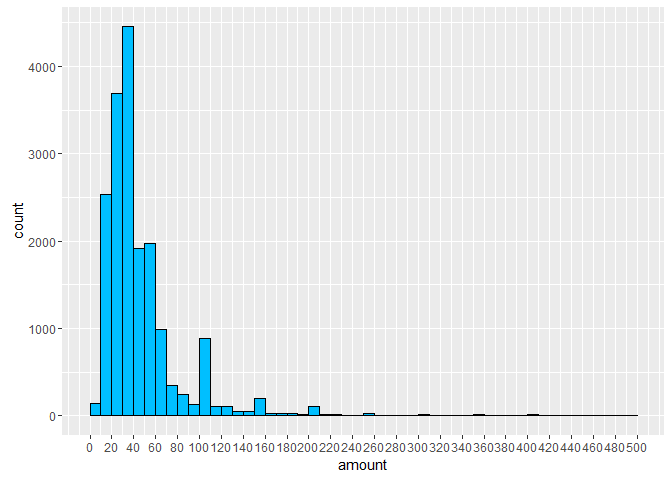
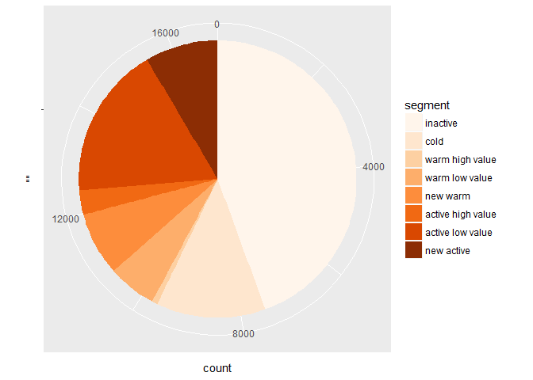
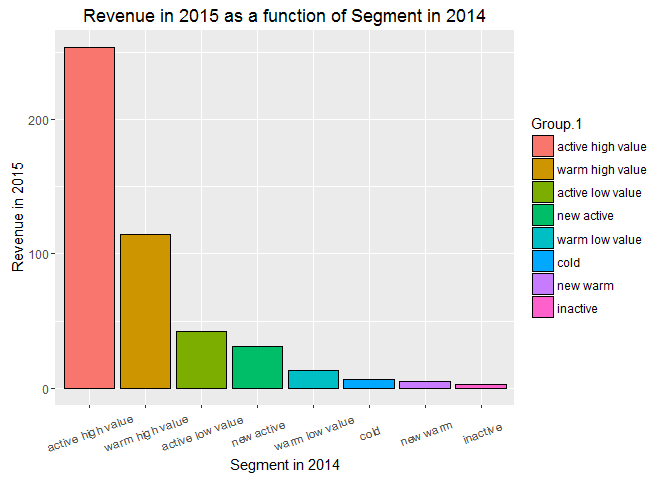

# Module 2 - Managerial segmentation
Nicolas  
April 19, 2016  

## Loading and preparing the dataset

### Loading the dataset

```r
setwd('C:/Users/Nicolas/Desktop/Projets Tech/MOOCS/Marketing Analytics/Module 2/')
data <- read.delim(file = 'purchases.txt', header = FALSE, sep = '\t', dec = '.')
```

### Adding headers and interpret the last column as a date, extract year of purchase

```r
colnames(data) <- c('customer_id', 'purchase_amount', 'date_of_purchase')
data$date_of_purchase <- as.Date(data$date_of_purchase, "%Y-%m-%d")
data$year_of_purchase <- as.numeric(format(data$date_of_purchase, "%Y"))
data$days_since       <- as.numeric(difftime(time1 = "2016-01-01",
                                            time2 = data$date_of_purchase,
                                            units = "days"))
```

### Exloring the dataset

```r
head(data)
```

```
##   customer_id purchase_amount date_of_purchase year_of_purchase days_since
## 1         760              25       2009-11-06             2009  2246.9583
## 2         860              50       2012-09-28             2012  1189.9583
## 3        1200             100       2005-10-25             2005  3719.9583
## 4        1420              50       2009-07-09             2009  2366.9583
## 5        1940              70       2013-01-25             2013  1070.9583
## 6        1960              40       2013-10-29             2013   793.9583
```

```r
summary(data)
```

```
##   customer_id     purchase_amount   date_of_purchase     year_of_purchase
##  Min.   :    10   Min.   :   5.00   Min.   :2005-01-02   Min.   :2005    
##  1st Qu.: 57720   1st Qu.:  25.00   1st Qu.:2009-01-17   1st Qu.:2009    
##  Median :102440   Median :  30.00   Median :2011-11-23   Median :2011    
##  Mean   :108935   Mean   :  62.34   Mean   :2011-07-14   Mean   :2011    
##  3rd Qu.:160525   3rd Qu.:  60.00   3rd Qu.:2013-12-29   3rd Qu.:2013    
##  Max.   :264200   Max.   :4500.00   Max.   :2015-12-31   Max.   :2015    
##    days_since      
##  Min.   :   0.958  
##  1st Qu.: 732.958  
##  Median :1499.958  
##  Mean   :1631.898  
##  3rd Qu.:2539.958  
##  Max.   :4015.958
```

### Computing key marketing indicators
Let's compute key marketing indicators: Recency, Frequency, and Monetary Value (average purchase amount):

```r
library(dplyr)
```

```
## 
## Attaching package: 'dplyr'
```

```
## The following objects are masked from 'package:stats':
## 
##     filter, lag
```

```
## The following objects are masked from 'package:base':
## 
##     intersect, setdiff, setequal, union
```

```r
customer_id_groups <- group_by(data, customer_id)     # first groups data by customer_id

customers_2015 <- summarise(customer_id_groups,  # then summarizes and creates new variables
                       recency = min(days_since),     # number of days since last purchase
                       first_purchase = max(days_since),     # number of days since first purchase
                       frequency = n(),                # number of purchases
                       amount = mean(purchase_amount))  # average purchase amount (monetary value)

head(customers_2015)
```

```
## Source: local data frame [6 x 5]
## 
##   customer_id   recency first_purchase frequency    amount
##         (int)     (dbl)          (dbl)     (int)     (dbl)
## 1          10 3828.9583       3828.958         1  30.00000
## 2          80  342.9583       3750.958         7  71.42857
## 3          90  757.9583       3782.958        10 115.80000
## 4         120 1400.9583       1400.958         1  20.00000
## 5         130 2969.9583       3709.958         2  50.00000
## 6         160 2962.9583       3576.958         2  30.00000
```

```r
summary(customers_2015)
```

```
##   customer_id        recency         first_purchase       frequency     
##  Min.   :    10   Min.   :   0.958   Min.   :   0.958   Min.   : 1.000  
##  1st Qu.: 81990   1st Qu.: 243.958   1st Qu.: 987.958   1st Qu.: 1.000  
##  Median :136430   Median :1069.958   Median :2086.958   Median : 2.000  
##  Mean   :137574   Mean   :1252.996   Mean   :1983.968   Mean   : 2.782  
##  3rd Qu.:195100   3rd Qu.:2129.958   3rd Qu.:2991.958   3rd Qu.: 3.000  
##  Max.   :264200   Max.   :4013.958   Max.   :4015.958   Max.   :45.000  
##      amount       
##  Min.   :   5.00  
##  1st Qu.:  21.67  
##  Median :  30.00  
##  Mean   :  57.79  
##  3rd Qu.:  50.00  
##  Max.   :4500.00
```

```r
#library(sqldf)
#customers_2015 = sqldf("SELECT customer_id,
#                               MIN(days_since) AS 'recency',
#                               MAX(days_since) AS 'first_purchase',
#                               COUNT(*) AS 'frequency',
#                               AVG(purchase_amount) AS 'amount'
#                        FROM data GROUP BY 1")
```

### Doing more data exploration

```r
library(ggplot2)

ggplot(data=customers_2015, aes(recency)) + geom_histogram(color = I('black'), fill= I('red3'))
```

```
## `stat_bin()` using `bins = 30`. Pick better value with `binwidth`.
```


```r
ggplot(data=customers_2015, aes(frequency)) + geom_histogram(color = I('black'), fill= I('orange'))
```

```
## `stat_bin()` using `bins = 30`. Pick better value with `binwidth`.
```


```r
ggplot(data=customers_2015, aes(amount)) + geom_histogram(binwidth = 10, color = I('black'), fill= I('deepskyblue')) +
   scale_x_continuous(limits = c(0, 500),
                     breaks = seq(0, 500, 20))
```

```
## Warning: Removed 167 rows containing non-finite values (stat_bin).
```

```
## Warning: Removed 2 rows containing missing values (geom_bar).
```



The frequency and monetary value distribution are skewed. 

***

## Performing a managerial segmentation

### A simple 2-segment solution based only on the Recency

Qualifies as 'inactive' all customers who made a purchase more than 3 years ago:

```r
customers_2015$segment <- ifelse(test = customers_2015$recency > 365*3, yes = "inactive", no = "NA")
```

Shows the number of inactive customers vs NA:

```r
table(customers_2015$segment)
```

```
## 
## inactive       NA 
##     9158     9259
```

Computes the average of the following variables between all inactive customers:
recency, first_purchase, frequency, and average purchase amount

```r
aggregate(x = customers_2015[, 2:5], by = list(customers_2015$segment), mean)
```

```
##    Group.1   recency first_purchase frequency   amount
## 1 inactive 2178.0692       2546.127  1.814479 48.11277
## 2       NA  338.0143       1427.942  3.739713 67.36760
```


### A more complex 3-segment solution based only on the Recency

```r
customers_2015$segment = ifelse(test = customers_2015$recency > 365*3,
                           yes = "inactive",
                           no = ifelse(test = customers_2015$recency > 365*2,
                                       yes = "cold",
                                       no = "NA"))

table(customers_2015$segment)
```

```
## 
##     cold inactive       NA 
##     1903     9158     7356
```

```r
aggregate(x = customers_2015[, 2:5], by = list(customers_2015$segment), mean)
```

```
##    Group.1   recency first_purchase frequency   amount
## 1     cold  857.7397       1432.076  2.303205 51.73989
## 2 inactive 2178.0692       2546.127  1.814479 48.11277
## 3       NA  203.5611       1426.873  4.111338 71.41050
```

We need to find a more robust solution than using 'if-else' statement.

### A simple 2-segment solution using the 'which' statement

```r
# Initially, every customer belongs to the 'NA' segment
customers_2015$segment = "NA"

# let's update only a subset of customers
customers_2015$segment[which(customers_2015$recency > 365*3)] = "inactive"

table(customers_2015$segment)
```

```
## 
## inactive       NA 
##     9158     9259
```

```r
aggregate(x = customers_2015[, 2:5], by = list(customers_2015$segment), mean)
```

```
##    Group.1   recency first_purchase frequency   amount
## 1 inactive 2178.0692       2546.127  1.814479 48.11277
## 2       NA  338.0143       1427.942  3.739713 67.36760
```

### A more complex 4-segment solution using 'which'

```r
customers_2015$segment = "NA"
# adding an 'inactive' segment:
customers_2015$segment[which(customers_2015$recency > 365*3)] = "inactive"
# adding an 'cold' segment:
customers_2015$segment[which(customers_2015$recency <= 365*3 & customers_2015$recency > 365*2)] = "cold"
# adding an 'warm' segment:
customers_2015$segment[which(customers_2015$recency <= 365*2 & customers_2015$recency > 365*1)] = "warm"
# adding an 'active' segment:
customers_2015$segment[which(customers_2015$recency <= 365)] = "active"

table(customers_2015$segment)
```

```
## 
##   active     cold inactive     warm 
##     5398     1903     9158     1958
```

```r
aggregate(x = customers_2015[, 2:5], by = list(customers_2015$segment), mean)
```

```
##    Group.1    recency first_purchase frequency   amount
## 1   active   99.69898       1465.802  4.560763 72.08094
## 2     cold  857.73973       1432.076  2.303205 51.73989
## 3 inactive 2178.06917       2546.127  1.814479 48.11277
## 4     warm  489.89807       1319.549  2.872319 69.56215
```

Note: make sure that every customer belongs to a segment and belongs to only one segment. Segment definition should not overlap.

### Complete segment solution using 'which' (ie subset)

```r
customers_2015$segment = "NA"

# First, creates major segments:

# adding an 'inactive' segment:
customers_2015$segment[which(customers_2015$recency > 365*3)] = "inactive"
# adding an 'cold' segment:
customers_2015$segment[which(customers_2015$recency <= 365*3 & customers_2015$recency > 365*2)] = "cold"
# adding an 'warm' segment:
customers_2015$segment[which(customers_2015$recency <= 365*2 & customers_2015$recency > 365*1)] = "warm"
# adding an 'active' segment:
customers_2015$segment[which(customers_2015$recency <= 365)] = "active"

# Then divides the above segments in sub-segments:

# adding an 'new warm' sub-segment:
customers_2015$segment[which(customers_2015$segment == "warm" & customers_2015$first_purchase <= 365*2)] = "new warm"
# adding an 'warm low value' sub-segment:
customers_2015$segment[which(customers_2015$segment == "warm" & customers_2015$amount < 100)] = "warm low value"
# adding an 'warm high value' sub-segment:
customers_2015$segment[which(customers_2015$segment == "warm" & customers_2015$amount >= 100)] = "warm high value"

# adding an 'new active' sub-segment:
customers_2015$segment[which(customers_2015$segment == "active" & customers_2015$first_purchase <= 365)] = "new active"
# adding an '"active low value' sub-segment:
customers_2015$segment[which(customers_2015$segment == "active" & customers_2015$amount < 100)] = "active low value"
# adding an 'active high value' sub-segment:
customers_2015$segment[which(customers_2015$segment == "active" & customers_2015$amount >= 100)] = "active high value"

table(customers_2015$segment)
```

```
## 
## active high value  active low value              cold          inactive 
##               573              3313              1903              9158 
##        new active          new warm   warm high value    warm low value 
##              1512               938               119               901
```

```r
aggregate(x = customers_2015[, 2:5], by = list(customers_2015$segment), mean)
```

```
##             Group.1    recency first_purchase frequency    amount
## 1 active high value   88.77858     1985.86758  5.888307 240.04574
## 2  active low value  108.31934     2003.76033  5.935406  40.72452
## 3              cold  857.73973     1432.07552  2.303205  51.73989
## 4          inactive 2178.06917     2546.12671  1.814479  48.11277
## 5        new active   84.94907       89.97222  1.045635  77.13385
## 6          new warm  509.26324      516.58093  1.044776  66.59903
## 7   warm high value  455.08438     2015.31127  4.714286 327.40746
## 8    warm low value  474.33569     2063.59762  4.531632  38.59193
```

For example, the 'active high value segment' has an average recency of 88 days with an average frequency of about 6 and an average purchase amount of $240.

### Re-ordering factors

```r
# needs to define the order of segments:
customers_2015$segment <- factor(x = customers_2015$segment, 
                levels = c("inactive", 
                           "cold", 
                           "warm high value", "warm low value", "new warm",
                           "active high value", "active low value", "new active"))

table(customers_2015$segment)
```

```
## 
##          inactive              cold   warm high value    warm low value 
##              9158              1903               119               901 
##          new warm active high value  active low value        new active 
##               938               573              3313              1512
```

```r
aggregate(x = customers_2015[, 2:5], by = list(customers_2015$segment), mean)
```

```
##             Group.1    recency first_purchase frequency    amount
## 1          inactive 2178.06917     2546.12671  1.814479  48.11277
## 2              cold  857.73973     1432.07552  2.303205  51.73989
## 3   warm high value  455.08438     2015.31127  4.714286 327.40746
## 4    warm low value  474.33569     2063.59762  4.531632  38.59193
## 5          new warm  509.26324      516.58093  1.044776  66.59903
## 6 active high value   88.77858     1985.86758  5.888307 240.04574
## 7  active low value  108.31934     2003.76033  5.935406  40.72452
## 8        new active   84.94907       89.97222  1.045635  77.13385
```

The table shows the least active segment first and the most active segment at the bottom.
This table helps to define a 'persona' (ie segment centroid or segment profile), meaning the profile of the average customer in each segment.
When going back in the past, needs to create a 'non-existent customers' segment when at that time these customers were non existent. Otherwise, the analysis will be flawed.

***

## Segmenting last year's customer database

How segmentation evolves? What are the trends? The idea here is to be able to compare the segmentation today and the segmentation a year ago, for example, based on the data which is available today.

### Computing key marketing indicators
Let's compute key marketing indicators: Recency, Frequency, and Monetary Value (average purchase amount):

```r
customer_id_groups <- group_by(data, customer_id)     # first groups data by customer_id

customers_2014 <- summarise(  # then summarizes data where days_since > 365 (last purchase was made more than a year ago)
                        subset(customer_id_groups, days_since > 365), #and creates new variables
                        recency = min(days_since) - 365,     # number of days since last purchase, starting from a year ago
                        first_purchase = max(days_since) - 365,     # number of days since first purchase, starting from a year ago
                        frequency = n(),                # number of purchases
                        amount = mean(purchase_amount))  # average purchase amount (monetary value)

head(customers_2014)
```

```
## Source: local data frame [6 x 5]
## 
##   customer_id   recency first_purchase frequency amount
##         (int)     (dbl)          (dbl)     (int)  (dbl)
## 1          10 3463.9583       3463.958         1   30.0
## 2          80  301.9583       3385.958         6   70.0
## 3          90  392.9583       3417.958        10  115.8
## 4         120 1035.9583       1035.958         1   20.0
## 5         130 2604.9583       3344.958         2   50.0
## 6         160 2597.9583       3211.958         2   30.0
```

```r
summary(customers_2014)
```

```
##   customer_id        recency         first_purchase       frequency     
##  Min.   :    10   Min.   :   0.958   Min.   :   0.958   Min.   : 1.000  
##  1st Qu.: 77710   1st Qu.: 257.958   1st Qu.: 795.958   1st Qu.: 1.000  
##  Median :127140   Median : 889.958   Median :1890.958   Median : 2.000  
##  Mean   :127315   Mean   :1122.545   Mean   :1788.369   Mean   : 2.665  
##  3rd Qu.:181800   3rd Qu.:1867.958   3rd Qu.:2694.958   3rd Qu.: 3.000  
##  Max.   :245840   Max.   :3648.958   Max.   :3650.958   Max.   :40.000  
##      amount       
##  Min.   :   5.00  
##  1st Qu.:  21.25  
##  Median :  30.00  
##  Mean   :  55.53  
##  3rd Qu.:  50.00  
##  Max.   :4500.00
```

We computed recency, frequency, and average purchase amount as if we were a year ago.
We notice that the number of customer increased by 1512 between 2014 and 2015.

### Complete segment solution using 'which'

```r
customers_2014$segment = "NA"

customers_2014$segment[which(customers_2014$recency > 365*3)] = "inactive"
customers_2014$segment[which(customers_2014$recency <= 365*3 & customers_2014$recency > 365*2)] = "cold"
customers_2014$segment[which(customers_2014$recency <= 365*2 & customers_2014$recency > 365*1)] = "warm"
customers_2014$segment[which(customers_2014$recency <= 365)] = "active"

customers_2014$segment[which(customers_2014$segment == "warm" & customers_2014$first_purchase <= 365*2)] = "new warm"
customers_2014$segment[which(customers_2014$segment == "warm" & customers_2014$amount < 100)] = "warm low value"
customers_2014$segment[which(customers_2014$segment == "warm" & customers_2014$amount >= 100)] = "warm high value"

customers_2014$segment[which(customers_2014$segment == "active" & customers_2014$first_purchase <= 365)] = "new active"
customers_2014$segment[which(customers_2014$segment == "active" & customers_2014$amount < 100)] = "active low value"
customers_2014$segment[which(customers_2014$segment == "active" & customers_2014$amount >= 100)] = "active high value"
```

### Re-ordering factors

```r
customers_2014$segment <- factor(x = customers_2014$segment, 
                    levels = c("inactive", 
                               "cold",
                               "warm high value", "warm low value", "new warm",
                               "active high value", "active low value", "new active"))
```

### Showing segmentation results

```r
table(customers_2014$segment)
```

```
## 
##          inactive              cold   warm high value    warm low value 
##              7512              2153               111               956 
##          new warm active high value  active low value        new active 
##              1250               475              3011              1437
```

A year ago, we had 1437 new customers, 7512 inactive customers


```r
ggplot(data=customers_2014, 
       aes(x="", fill=segment))+
  geom_bar(width = 1) + coord_polar(theta="y") +
  scale_fill_brewer(palette="Oranges")
```



Looking at the chart, abouta third of customers were inactive, about 10% were new active, etc.

Average values for 2014:

```r
aggregate(x = customers_2014[, 2:5], by = list(customers_2014$segment), mean)
```

```
##             Group.1    recency first_purchase frequency    amount
## 1          inactive 2058.39963      2352.9952  1.730964  48.11120
## 2              cold  866.57515      1565.4024  2.254064  51.11460
## 3   warm high value  461.15653      1878.7691  4.414414 187.84911
## 4    warm low value  470.61942      1945.3851  4.361925  37.38206
## 5          new warm  497.27593       504.8383  1.057600  51.36765
## 6 active high value   85.29728      1838.0089  5.696842 261.90216
## 7  active low value   98.04933      1796.3097  5.633677  40.45917
## 8        new active  132.04532       142.8296  1.070981  69.72516
```

***

## Computing revenue generation per segment 

How the segmentation today will contribute to today's revenues?
How the segmentation today will contribute to tomorrow's revenues?
You need to sum up revenues by segment.

Forward-looking revenue generation analysis: from what customers today will come tomorrow's revenue? Our high-value customers today will remain loyal tomorrow? How much revenue your newly acquired customers will generate a year from now?

It is likely that the customer today will actu tomorrow the same way the customer yesterday acted today.

### Computing how much revenue is generated for each segment


```r
#library(sqldf)
#revenue_2015 = sqldf("SELECT customer_id, SUM(purchase_amount) AS 'revenue_2015'
#                      FROM data
#                      WHERE year_of_purchase = 2015
#                      GROUP BY 1")
```

which is equivalent to, with the dplyr library (using the %>% piping operator):


```r
revenue_2015 <- data %>% filter(year_of_purchase == 2015) %>% 
                group_by(customer_id) %>% 
                summarize(revenue_2015 = sum(purchase_amount)) 
                # creates a new variable: the sum of purchase amount in 2015

summary(revenue_2015)
```

```
##   customer_id      revenue_2015    
##  Min.   :    80   Min.   :   5.00  
##  1st Qu.:104105   1st Qu.:  30.00  
##  Median :185495   Median :  50.00  
##  Mean   :167782   Mean   :  88.62  
##  3rd Qu.:246058   3rd Qu.:  85.00  
##  Max.   :264200   Max.   :4500.00
```

Notice that this shows only the revenue of customers who made purchases in 2015. However, we want to see the revenue of all customers, even if revenue is zero. To do so, we have to merge 2015 customers and 2015 revenue.

### Merging 2015 customers and 2015 revenue

```r
actual <- merge(x=customers_2015, y=revenue_2015, by='customer_id', all.x = TRUE) 
# adding all.x=TRUE includes all cases from the x table (LEFT)

actual$revenue_2015[is.na(actual$revenue_2015)] <- 0  # replaces all NAs by zeros
```

### Showing average revenue per customer and per segment

```r
aggregate(x = actual$revenue_2015, by = list(customers_2015$segment), mean)
```

```
##             Group.1         x
## 1          inactive   0.00000
## 2              cold   0.00000
## 3   warm high value   0.00000
## 4    warm low value   0.00000
## 5          new warm   0.00000
## 6 active high value 323.56894
## 7  active low value  52.30604
## 8        new active  79.16614
```

New active customers have generated about $80 of revenue in 2015.
By definition, inactive customers havent generated any revenue in 2015.

### Merging 2014 customers and 2015 revenue

Now, we would like to estimate how much revenue we can expect next year from an active customer today. To get an intuition for 2016, we can observe how much revenue we got from an active customer in 2014 going into 2015. To do so, we merge the revenue generated in 2015 with the customer list of 2014: how much revenue is generated by each customer in 2015, based on the segment they were in 2014.


```r
forward = merge(x=customers_2014, y=revenue_2015, by='customer_id', all.x = TRUE)
forward$revenue_2015[is.na(forward$revenue_2015)] = 0
```

### Showing the average revenue per customer and per segment

```r
r <- aggregate(x = forward$revenue_2015, by = list(customers_2014$segment), mean)
r
```

```
##             Group.1          x
## 1          inactive   2.949466
## 2              cold   6.108221
## 3   warm high value 114.459459
## 4    warm low value  13.494770
## 5          new warm   5.064000
## 6 active high value 254.077895
## 7  active low value  41.896556
## 8        new active  31.046625
```

For example, an inactive customer in 2014 generated about $3 of revenue in 2015, on average.
A warm high value customer in 2014 generated about $114 of revenue in 2015, on average. This is much more revenue than the one generated by new active customers in 2014 (who made only one purchase and might not remain active a year from now).

### Re-ordering and displaying the results

```r
r <- arrange(r, desc(x) )   # arrange the dataframe by decreasing x
r <- mutate(r, Group.1 = factor(Group.1, Group.1))  # orders the levels of a factor based on the row order of a dataframe
# or instead of mutate:
#r$Group.1 <- reorder(r$Group.1, -r$x)   # and reorders the factor levels

# or equivalently 
#r <- r[order(r$x, decreasing = TRUE), ]

r
```

```
##             Group.1          x
## 1 active high value 254.077895
## 2   warm high value 114.459459
## 3  active low value  41.896556
## 4        new active  31.046625
## 5    warm low value  13.494770
## 6              cold   6.108221
## 7          new warm   5.064000
## 8          inactive   2.949466
```

```r
ggplot(data=r, aes(x=Group.1, y=x, fill=Group.1)) +   
      geom_bar(colour="black", stat="identity") + 
      theme(axis.text.x=element_text(angle=20,hjust=0.5,vjust=0.5)) +
      labs(x="Segment in 2014",y="Revenue in 2015") +
      ggtitle("Revenue in 2015 as a function of Segment in 2014") 
```



The chart shows which customers are the most profitable a year later: active high value customer comes first with $254 average revenue. New active customer comes only 4th with an expected revenue of $31 next year.

Also, loosing one active high value customer is about loosing six new active customers. From a managerial perspective, one active high value customer is worth about six times more than a new active customer.
