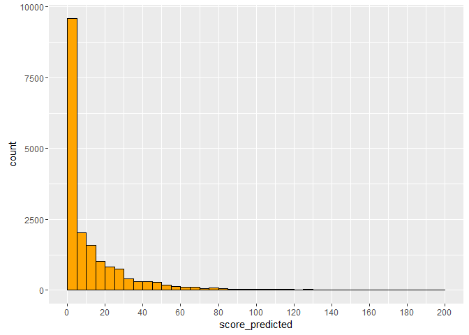

# Module 3 - Targeting and Scoring
Nicolas  
April 20, 2016  


## Computing predictors and target variables

### Loading the dataset

```r
setwd('C:/Users/Nicolas/Desktop/Projets Tech/MOOCS/Marketing Analytics/')
data <- read.delim(file = 'purchases.txt', header = FALSE, sep = '\t', dec = '.')
```

### Adding headers and interpret the last column as a date, extract year of purchase

```r
colnames(data) <- c('customer_id', 'purchase_amount', 'date_of_purchase')
data$date_of_purchase <- as.Date(data$date_of_purchase, "%Y-%m-%d")
data$year_of_purchase <- as.numeric(format(data$date_of_purchase, "%Y"))
data$days_since       <- as.numeric(difftime(time1 = "2016-01-01",
                                            time2 = data$date_of_purchase,
                                            units = "days"))
```

### Computing key marketing indicators
Let's compute key marketing indicators: RFM variables as of a year ago, in 2014

```r
library(dplyr)
```

```
## 
## Attaching package: 'dplyr'
```

```
## The following objects are masked from 'package:stats':
## 
##     filter, lag
```

```
## The following objects are masked from 'package:base':
## 
##     intersect, setdiff, setequal, union
```

```r
customers_2014 <- data %>% filter(days_since > 365) %>% 
                  group_by(customer_id) %>% 
                  summarize(   # creates new variables:
                    recency = min(days_since) - 365,
                    first_purchase = max(days_since) - 365,
                    frequency = n(),
                    avg_amount = mean(purchase_amount),
                    max_amount = max(purchase_amount)    ) 
```

Here we are extracting all the predictors that we will use in the predictive model. Predictors are variables computed a year ago.

### Computing revenues generated by customers in 2015

```r
revenue_2015 <- data %>% filter(year_of_purchase == 2015) %>% 
                  group_by(customer_id) %>% 
                  summarize(   # creates a new variable:
                    revenue_2015 = sum(purchase_amount)  ) 
```

Here we are extracting the target variable. The next step is to merge both predictors and target variable to create the calibration dataset (ie the training dataset).

### Merging 2014 customers and 2015 revenue datasets

```r
# in_sample should be named training_df
# out_sample should be named test_df
in_sample <- merge(customers_2014, revenue_2015, all.x = TRUE)
in_sample$revenue_2015[is.na(in_sample$revenue_2015)] <- 0

# we add a new variable 'active_2015': 1 if there was a revenue in 2015, 0 otherwise
in_sample$active_2015 <- as.numeric(in_sample$revenue_2015 > 0)
```

in_sample dataset includes now the following data:
  - from customer_2014:
      - first_purchase
      - frequency
      - avg_amount
      - max_amount
  - from revenue_2015:
      - revenue_2015
  - active_2015 (1 or 0)

### Displaying calibration (in-sample) data (i.e. the training dataset)

```r
head(in_sample)
```

```
##   customer_id   recency first_purchase frequency avg_amount max_amount
## 1          10 3463.9583       3463.958         1       30.0         30
## 2          80  301.9583       3385.958         6       70.0         80
## 3          90  392.9583       3417.958        10      115.8        153
## 4         120 1035.9583       1035.958         1       20.0         20
## 5         130 2604.9583       3344.958         2       50.0         60
## 6         160 2597.9583       3211.958         2       30.0         30
##   revenue_2015 active_2015
## 1            0           0
## 2           80           1
## 3            0           0
## 4            0           0
## 5            0           0
## 6            0           0
```

```r
summary(in_sample)
```

```
##   customer_id        recency         first_purchase       frequency     
##  Min.   :    10   Min.   :   0.958   Min.   :   0.958   Min.   : 1.000  
##  1st Qu.: 77710   1st Qu.: 257.958   1st Qu.: 795.958   1st Qu.: 1.000  
##  Median :127140   Median : 889.958   Median :1890.958   Median : 2.000  
##  Mean   :127315   Mean   :1122.545   Mean   :1788.369   Mean   : 2.665  
##  3rd Qu.:181800   3rd Qu.:1867.958   3rd Qu.:2694.958   3rd Qu.: 3.000  
##  Max.   :245840   Max.   :3648.958   Max.   :3650.958   Max.   :40.000  
##    avg_amount        max_amount       revenue_2015      active_2015    
##  Min.   :   5.00   Min.   :   5.00   Min.   :   0.00   Min.   :0.0000  
##  1st Qu.:  21.25   1st Qu.:  25.00   1st Qu.:   0.00   1st Qu.:0.0000  
##  Median :  30.00   Median :  30.00   Median :   0.00   Median :0.0000  
##  Mean   :  55.53   Mean   :  65.72   Mean   :  21.22   Mean   :0.2299  
##  3rd Qu.:  50.00   3rd Qu.:  60.00   3rd Qu.:   0.00   3rd Qu.:0.0000  
##  Max.   :4500.00   Max.   :4500.00   Max.   :4500.00   Max.   :1.0000
```

***

## Fitting the two models

### 1. Fitting the first model: the probability model

Here, we create a model to predict whether a customer is active in 2015 or not, based on the customer data of 2014.

The outcome of the prediction is either 1 or 0 (ie. two classes). This is a classification problem that can be solved using a logistic regression. The following code fits the above training set to a form of logistic regression, a multinomial log-linear model via neural networks.


```r
#library(nnet) # loads the Neural Network library

#prob.model <- multinom(
#  formula = active_2015 ~ recency + first_purchase + frequency + avg_amount + max_amount,
#  data = in_sample)
 #The formula expression, as for regression models, is of the form response ~ predictors

#summary(prob.model)
```

Multinomial logistic regression is a classification method that generalizes logistic regression to multiclass problems, i.e. with more than two possible discrete outcomes.[1] That is, it is a model that is used to predict the probabilities of the different possible outcomes of a categorically distributed dependent variable, given a set of independent variable. (Wikipedia)
=> Multinomial means there are more than two possible discrete outcomes.
Note: logistic regression is called also logit regression.
A log-linear model is a mathematical model that takes the form of a function whose logarithm is a linear combination of the parameters of the model, which makes it possible to apply (possibly multivariate) linear regression. 
Then we train a neural network on the training set (in_sample) to learn the coefficient of the classification model.

Or we can use a simple logistic regression model:

```r
prob.model <- glm(active_2015 ~ recency + first_purchase + frequency + avg_amount + max_amount,
    family=binomial(link='logit'),
    data=in_sample)

summary(prob.model)
```

```
## 
## Call:
## glm(formula = active_2015 ~ recency + first_purchase + frequency + 
##     avg_amount + max_amount, family = binomial(link = "logit"), 
##     data = in_sample)
## 
## Deviance Residuals: 
##     Min       1Q   Median       3Q      Max  
## -2.7232  -0.6154  -0.2260  -0.0633   3.8235  
## 
## Coefficients:
##                  Estimate Std. Error z value Pr(>|z|)    
## (Intercept)    -5.332e-01  4.410e-02 -12.089   <2e-16 ***
## recency        -1.965e-03  6.000e-05 -32.749   <2e-16 ***
## first_purchase -1.167e-05  3.926e-05  -0.297    0.766    
## frequency       2.195e-01  1.479e-02  14.840   <2e-16 ***
## avg_amount      4.159e-04  3.635e-04   1.144    0.253    
## max_amount     -1.558e-04  2.714e-04  -0.574    0.566    
## ---
## Signif. codes:  0 '***' 0.001 '**' 0.01 '*' 0.05 '.' 0.1 ' ' 1
## 
## (Dispersion parameter for binomial family taken to be 1)
## 
##     Null deviance: 18228  on 16904  degrees of freedom
## Residual deviance: 12369  on 16899  degrees of freedom
## AIC: 12381
## 
## Number of Fisher Scoring iterations: 6
```

Then shows the coefficients of the model 

```r
#coef <- summary(prob.model)$coefficients      # when using multinom
coef <- summary(prob.model)$coefficients[,1]   # when using glm
coef
```

```
##    (Intercept)        recency first_purchase      frequency     avg_amount 
##  -5.331993e-01  -1.964968e-03  -1.167371e-05   2.195110e-01   4.159140e-04 
##     max_amount 
##  -1.557939e-04
```

The coefficient (weight) of the recency is negative, which makes sense: the larger the recency, the smaller the probability the customer will make another purchase in the future.
However, the coefficient (weight) of the frequency is positive, meaning that the more purchases the customer made in the past, the more likely he'll make additional purchase in the future.

Then shows its standard deviation:

```r
#std  <- summary(prob.model)$standard.errors  # when using multinom
std <- summary(prob.model)$coefficients[,2]   # when using glm
std
```

```
##    (Intercept)        recency first_purchase      frequency     avg_amount 
##   4.410472e-02   6.000154e-05   3.925538e-05   1.479159e-02   3.634788e-04 
##     max_amount 
##   2.713770e-04
```

and the ratio of the coefficient divided by its standard deviation:

```r
coef / std
```

```
##    (Intercept)        recency first_purchase      frequency     avg_amount 
##    -12.0893912    -32.7486251     -0.2973786     14.8402608      1.1442593 
##     max_amount 
##     -0.5740866
```

As a rule, when coef/std is above 2 or below -2, the parameter value is significant (i.e. Z = +/- 1.96). Here, the impact of first_purchase, avg_amount and max_amount on the predictions is limited.


### 2. Fitting the second model: the monetary model

Here, we create a model to predict the revenue generated by a customer in 2015, based on the average amount and maximum amount he spent in 2014.

First, let's select from the training set only customers who made a purchase in 2015:

```r
z <- which(in_sample$active_2015 == 1)    # store the index of active customer in 2015
head(in_sample[z, ])
```

```
##    customer_id    recency first_purchase frequency avg_amount max_amount
## 2           80  301.95833       3385.958         6   70.00000         80
## 18         480   15.95833       3312.958        11   62.27273        235
## 30         830  266.95833       3373.958         6   48.33333         60
## 31         850   61.95833       3050.958         8   28.12500         30
## 32         860  266.95833       3642.958         9   53.33333         60
## 39        1020 1461.95833       1826.958         3   73.33333        100
##    revenue_2015 active_2015
## 2            80           1
## 18           45           1
## 30           50           1
## 31           60           1
## 32           60           1
## 39          120           1
```

```r
summary(in_sample[z, ])
```

```
##   customer_id        recency         first_purchase       frequency     
##  Min.   :    80   Min.   :   0.958   Min.   :   0.958   Min.   : 1.000  
##  1st Qu.: 78590   1st Qu.:  22.958   1st Qu.: 649.708   1st Qu.: 2.000  
##  Median :143550   Median :  96.958   Median :1603.958   Median : 4.000  
##  Mean   :134907   Mean   : 306.305   Mean   :1636.122   Mean   : 4.741  
##  3rd Qu.:194363   3rd Qu.: 327.958   3rd Qu.:2665.958   3rd Qu.: 7.000  
##  Max.   :236660   Max.   :3543.958   Max.   :3646.958   Max.   :40.000  
##    avg_amount        max_amount       revenue_2015     active_2015
##  Min.   :   5.00   Min.   :   5.00   Min.   :   5.0   Min.   :1   
##  1st Qu.:  30.00   1st Qu.:  30.00   1st Qu.:  30.0   1st Qu.:1   
##  Median :  40.00   Median :  50.00   Median :  50.0   Median :1   
##  Mean   :  67.78   Mean   :  88.33   Mean   :  92.3   Mean   :1   
##  3rd Qu.:  60.00   3rd Qu.:  80.00   3rd Qu.: 100.0   3rd Qu.:1   
##  Max.   :4500.00   Max.   :4500.00   Max.   :4500.0   Max.   :1
```

Then let's fit the monetary model with the training set: revenue generated by a customer in 2015, as a function of its average amount and its maximum amount. Since the revenue can take a range of value (not only either 1 or 0), this is a regression problem that can be solved here using a linear model (lm):

```r
amount.model <- lm(
  formula = revenue_2015 ~ avg_amount + max_amount, 
  data = in_sample[z, ])     # fits the model only to active customers in 2015 in the training set

summary(amount.model)
```

```
## 
## Call:
## lm(formula = revenue_2015 ~ avg_amount + max_amount, data = in_sample[z, 
##     ])
## 
## Residuals:
##     Min      1Q  Median      3Q     Max 
## -2138.5   -20.1   -16.6     0.1  3361.8 
## 
## Coefficients:
##             Estimate Std. Error t value Pr(>|t|)    
## (Intercept) 20.74709    2.38112   8.713   <2e-16 ***
## avg_amount   0.67486    0.03280  20.575   <2e-16 ***
## max_amount   0.29225    0.02363  12.367   <2e-16 ***
## ---
## Signif. codes:  0 '***' 0.001 '**' 0.01 '*' 0.05 '.' 0.1 ' ' 1
## 
## Residual standard error: 136.6 on 3883 degrees of freedom
## Multiple R-squared:  0.6054,	Adjusted R-squared:  0.6052 
## F-statistic:  2979 on 2 and 3883 DF,  p-value: < 2.2e-16
```

All statistics (standard error, t value) are highly significant.
The coefficient of determination R^2 value is 0.60.

### Plotting the monetary model results

In order to validate our our model (on the training set), let's plot the prediction of revenue generated by 2015 customers, computed with the linear model, against the revenue generated by 2015 customers (the ground truth):


```r
plot(x = in_sample[z, ]$revenue_2015,
     y = amount.model$fitted.values)
```


```r
# Note: ggplot requires data from the same dataframe. Simpler to use plot here.
```

If our model is accurate, we should see linear relation between the prediction and the ground truth, which is not the case here: most customers have spent small amounts,few outliers have spent huge amounts.

### Re-fitting the monetary model, using now a log-transform

Let's try again with a log-transform:

```r
amount.model <- lm(
  formula = log(revenue_2015) ~ log(avg_amount) + log(max_amount), 
  data = in_sample[z, ])

summary(amount.model)
```

```
## 
## Call:
## lm(formula = log(revenue_2015) ~ log(avg_amount) + log(max_amount), 
##     data = in_sample[z, ])
## 
## Residuals:
##     Min      1Q  Median      3Q     Max 
## -2.7866 -0.1811 -0.0770  0.1852  3.5656 
## 
## Coefficients:
##                 Estimate Std. Error t value Pr(>|t|)    
## (Intercept)      0.37000    0.04003   9.242   <2e-16 ***
## log(avg_amount)  0.54881    0.04167  13.171   <2e-16 ***
## log(max_amount)  0.38813    0.03796  10.224   <2e-16 ***
## ---
## Signif. codes:  0 '***' 0.001 '**' 0.01 '*' 0.05 '.' 0.1 ' ' 1
## 
## Residual standard error: 0.4781 on 3883 degrees of freedom
## Multiple R-squared:  0.6927,	Adjusted R-squared:  0.6926 
## F-statistic:  4377 on 2 and 3883 DF,  p-value: < 2.2e-16
```

We can see that the R^2 has improved to 0.69 meaning that we fit the data much better.

### Plotting the results of this new monetary model

```r
plot(x = log(in_sample[z, ]$revenue_2015), 
     y = amount.model$fitted.values)      
```


This is much better. We put less weight to the very large values and more weight to the smaller values.

***

## Applying the models on today's data

Now that we fitted our two models (prob.model and amount.model) to 2015's data (as a function of 2014's data), we want to apply the two models to 2015's data in order to predict future behavior of customers in 2016.

### Computing RFM variables as of today, in 2015

```r
customers_2015 <- data %>% group_by(customer_id) %>% 
                  summarize(   # creates new variables:
                    recency = min(days_since),
                    first_purchase = max(days_since),
                    frequency = n(),
                    avg_amount = mean(purchase_amount),
                    max_amount = max(purchase_amount)    ) 
```

### Predicting the target variables based on today's data

Now we are predicting the probability that a customer will be active in 2016 (ie the probability that the outcome is 1):

```r
customers_2015$prob_predicted <- predict(object = prob.model, 
                                         newdata = customers_2015, 
                                         type = "response")  # argument to get the probability that the outcome is 1, using the glm function
                                         #type = "probs")    # argument to get the probability that the outcome is 1, using the multinomial function
```

and predicting the revenue generated by a customer in 2016 (taking the exp of the prediction, since we fitted the model using a log transform):

```r
customers_2015$revenue_predicted <- exp(predict(object = amount.model, 
                                                newdata = customers_2015))
```

Then we compute the score of customers, defined as the probability that a customer will be active in 2016 times the predicted revenue generated in 2016:

```r
customers_2015$score_predicted <- customers_2015$prob_predicted * customers_2015$revenue_predicted
```

If there is a 10% chance that a customer generates $100, the score will be 10.

Then displays results:

```r
summary(customers_2015$prob_predicted)
```

```
##      Min.   1st Qu.    Median      Mean   3rd Qu.      Max. 
## 0.0002631 0.0126400 0.1062000 0.2250000 0.3978000 0.9999000
```

Customers has a 22.5% chance of a customer being active in 2016, on average.


```r
summary(customers_2015$revenue_predicted)
```

```
##    Min. 1st Qu.  Median    Mean 3rd Qu.    Max. 
##    6.54   29.00   35.05   65.63   57.30 3833.00
```

Customers are predicted to generate a revenue of $65 in 2016, on average.
The minimum revenue is $6.5 (and not $0 because it assumes the customer will spend something).


```r
summary(customers_2015$score_predicted)
```

```
##      Min.   1st Qu.    Median      Mean   3rd Qu.      Max. 
##    0.0033    0.4558    4.5560   18.8300   17.9600 2854.0000
```

The score has a mean of 18.8. This value is extremely important from a managerial standpoint: on average, every customer will spend $18.8 next year, in 2016. This is the expected revenue in 2016.


```r
library(ggplot2)

ggplot(data=customers_2015, aes(score_predicted)) + 
  geom_histogram(binwidth = 5, color = I('black'), fill= I('orange')) +
  scale_x_continuous(limits = c(0, 200),
                     breaks = seq(0, 200, 20))
```

```
## Warning: Removed 196 rows containing non-finite values (stat_bin).
```

```
## Warning: Removed 2 rows containing missing values (geom_bar).
```



### Question

How many customers have an expected revenue of more than $50?


```r
z = which(customers_2015$score_predicted > 50)
length(z)
```

```
## [1] 1324
```

1324 customers have an expected revenue of more than $50 in 2016. We have the list of customers on which we should spend the most marketing dollar (ie the customers with the highest score).
