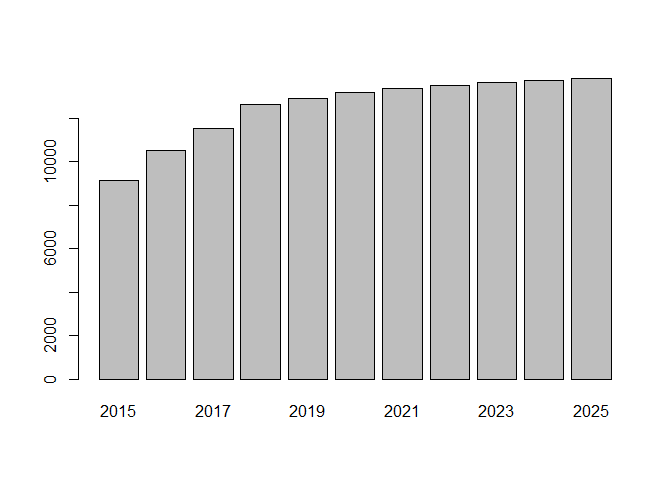
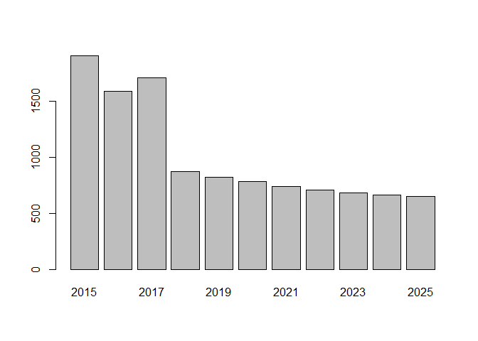
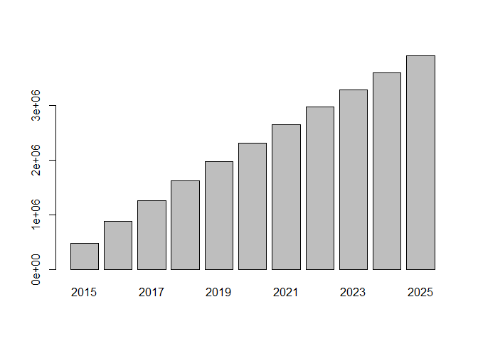
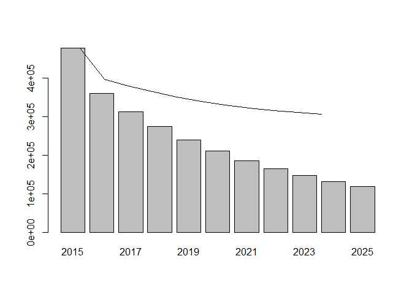
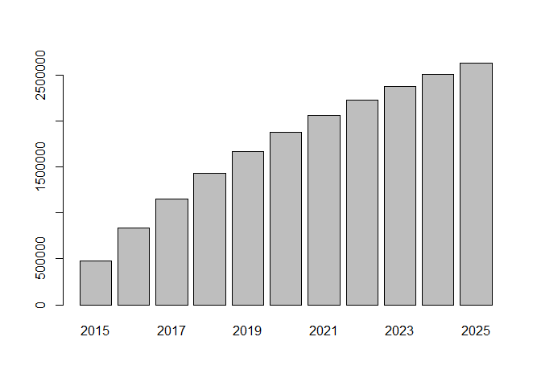

# Module 4 - Customer Lifetime Value
Nicolas  
April 22, 2016  

## 1. Segmenting the customer database in 2014 and 2015

### Loading the dataset

```r
data = read.delim(file = 'purchases.txt', header = FALSE, sep = '\t', dec = '.')
```

### Adding headers and interpret the last column as a date, extract year of purchase

```r
colnames(data) = c('customer_id', 'purchase_amount', 'date_of_purchase')
data$date_of_purchase = as.Date(data$date_of_purchase, "%Y-%m-%d")
data$year_of_purchase = as.numeric(format(data$date_of_purchase, "%Y"))
data$days_since       = as.numeric(difftime(time1 = "2016-01-01",
                                            time2 = data$date_of_purchase,
                                            units = "days"))
```

### Computing key marketing indicators for customers in 2015

```r
library(dplyr)

customers_2015 <- data %>% group_by(customer_id) %>% 
                  summarize(   # creates new variables:
                    recency = min(days_since),
                    first_purchase = max(days_since),
                    frequency = n(),
                    amount = mean(purchase_amount)  ) 
```

### Segmenting the customer database in 2015

Let's define 8 segments:
- inactive
- cold
- warm: new warm, warm high value, warm low value
- active: new active, active high value, active low value


```r
customers_2015$segment = "NA"
customers_2015$segment[which(customers_2015$recency > 365*3)] = "inactive"
customers_2015$segment[which(customers_2015$recency <= 365*3 & customers_2015$recency > 365*2)] = "cold"
customers_2015$segment[which(customers_2015$recency <= 365*2 & customers_2015$recency > 365*1)] = "warm"
customers_2015$segment[which(customers_2015$recency <= 365)] = "active"
customers_2015$segment[which(customers_2015$segment == "warm" & customers_2015$first_purchase <= 365*2)] = "new warm"
customers_2015$segment[which(customers_2015$segment == "warm" & customers_2015$amount < 100)] = "warm low value"
customers_2015$segment[which(customers_2015$segment == "warm" & customers_2015$amount >= 100)] = "warm high value"
customers_2015$segment[which(customers_2015$segment == "active" & customers_2015$first_purchase <= 365)] = "new active"
customers_2015$segment[which(customers_2015$segment == "active" & customers_2015$amount < 100)] = "active low value"
customers_2015$segment[which(customers_2015$segment == "active" & customers_2015$amount >= 100)] = "active high value"
```

And then reordering the factors:

```r
customers_2015$segment <- factor(x = customers_2015$segment, 
                                levels = c("inactive", "cold",
                            "warm high value", "warm low value", "new warm",
                            "active high value", "active low value", "new active"))
```


### Computing key marketing indicators for customers in 2014

```r
customers_2014 <- data %>% filter(days_since > 365) %>%
                  group_by(customer_id) %>% 
                  summarize(   # creates new variables:
                    recency = min(days_since) - 365,
                    first_purchase = max(days_since) - 365,
                    frequency = n(),
                    amount = mean(purchase_amount)  ) 
```

### Segmenting the customer database in 2014

```r
customers_2014$segment = "NA"
customers_2014$segment[which(customers_2014$recency > 365*3)] = "inactive"
customers_2014$segment[which(customers_2014$recency <= 365*3 & customers_2014$recency > 365*2)] = "cold"
customers_2014$segment[which(customers_2014$recency <= 365*2 & customers_2014$recency > 365*1)] = "warm"
customers_2014$segment[which(customers_2014$recency <= 365)] = "active"
customers_2014$segment[which(customers_2014$segment == "warm" & customers_2014$first_purchase <= 365*2)] = "new warm"
customers_2014$segment[which(customers_2014$segment == "warm" & customers_2014$amount < 100)] = "warm low value"
customers_2014$segment[which(customers_2014$segment == "warm" & customers_2014$amount >= 100)] = "warm high value"
customers_2014$segment[which(customers_2014$segment == "active" & customers_2014$first_purchase <= 365)] = "new active"
customers_2014$segment[which(customers_2014$segment == "active" & customers_2014$amount < 100)] = "active low value"
customers_2014$segment[which(customers_2014$segment == "active" & customers_2014$amount >= 100)] = "active high value"
```

And we reorder the factors:

```r
customers_2014$segment <- factor(x = customers_2014$segment, 
                                 levels = c("inactive", "cold",
                                  "warm high value", "warm low value", "new warm",
                                  "active high value", "active low value", "new active"))
```

***

## 2. Computing the Transition matrix

### Merging the customers_2014 and customers_2015 dataset

First, let's merge the customer_2014 and customers_2015 datasets:

```r
new_data <- merge(x = customers_2014, y = customers_2015, by = "customer_id", all.x = TRUE)
head(new_data)
```

```
##   customer_id recency.x first_purchase.x frequency.x amount.x
## 1          10 3463.9583         3463.958           1     30.0
## 2          80  301.9583         3385.958           6     70.0
## 3          90  392.9583         3417.958          10    115.8
## 4         120 1035.9583         1035.958           1     20.0
## 5         130 2604.9583         3344.958           2     50.0
## 6         160 2597.9583         3211.958           2     30.0
##          segment.x recency.y first_purchase.y frequency.y  amount.y
## 1         inactive 3828.9583         3828.958           1  30.00000
## 2 active low value  342.9583         3750.958           7  71.42857
## 3  warm high value  757.9583         3782.958          10 115.80000
## 4             cold 1400.9583         1400.958           1  20.00000
## 5         inactive 2969.9583         3709.958           2  50.00000
## 6         inactive 2962.9583         3576.958           2  30.00000
##          segment.y
## 1         inactive
## 2 active low value
## 3             cold
## 4         inactive
## 5         inactive
## 6         inactive
```

### Non-normlized transition matrix
Let's create an occurence table (the non-normlized transition matrix):

```r
transition <- table(new_data$segment.x, new_data$segment.y)
transition
```

```
##                    
##                     inactive cold warm high value warm low value new warm
##   inactive              7227    0               0              0        0
##   cold                  1931    0               0              0        0
##   warm high value          0   75               0              0        0
##   warm low value           0  689               0              0        0
##   new warm                 0 1139               0              0        0
##   active high value        0    0             119              0        0
##   active low value         0    0               0            901        0
##   new active               0    0               0              0      938
##                    
##                     active high value active low value new active
##   inactive                         35              250          0
##   cold                             22              200          0
##   warm high value                  35                1          0
##   warm low value                    1              266          0
##   new warm                         15               96          0
##   active high value               354                2          0
##   active low value                 22             2088          0
##   new active                       89              410          0
```

For example, from 7227 inactive customers in 2014, 35 became active high value customers in 2015.

### Normalizing the transition matrix

Then let's normalize the transition matrix to have proportion:

```r
transition <- transition / rowSums(transition)   # the sum of each row equals to 1
transition
```

```
##                    
##                        inactive        cold warm high value warm low value
##   inactive          0.962060703 0.000000000     0.000000000    0.000000000
##   cold              0.896888063 0.000000000     0.000000000    0.000000000
##   warm high value   0.000000000 0.675675676     0.000000000    0.000000000
##   warm low value    0.000000000 0.720711297     0.000000000    0.000000000
##   new warm          0.000000000 0.911200000     0.000000000    0.000000000
##   active high value 0.000000000 0.000000000     0.250526316    0.000000000
##   active low value  0.000000000 0.000000000     0.000000000    0.299236134
##   new active        0.000000000 0.000000000     0.000000000    0.000000000
##                    
##                        new warm active high value active low value
##   inactive          0.000000000       0.004659212      0.033280085
##   cold              0.000000000       0.010218300      0.092893637
##   warm high value   0.000000000       0.315315315      0.009009009
##   warm low value    0.000000000       0.001046025      0.278242678
##   new warm          0.000000000       0.012000000      0.076800000
##   active high value 0.000000000       0.745263158      0.004210526
##   active low value  0.000000000       0.007306543      0.693457323
##   new active        0.652748782       0.061934586      0.285316632
##                    
##                      new active
##   inactive          0.000000000
##   cold              0.000000000
##   warm high value   0.000000000
##   warm low value    0.000000000
##   new warm          0.000000000
##   active high value 0.000000000
##   active low value  0.000000000
##   new active        0.000000000
```

For example, active high value customers in 2014 had a 25% chance to become warm high value customers in 2015.


***


## 3. Using the transition matrix to make predictions

### Initializing a matrix with the number of customers in each segment

The first column holds the number of customer today (2015). 
The other columns are placeholder for the  number of customer for the next following 9 years (11  periods of 1 year in total)

```r
segments <- matrix(nrow = 8, ncol = 11)           # 8 segments ; 11 periods of 1 year
segments[, 1] <- table(customers_2015$segment)
colnames(segments) <- 2015:2025
row.names(segments) <- levels(customers_2015$segment)
segments
```

```
##                   2015 2016 2017 2018 2019 2020 2021 2022 2023 2024 2025
## inactive          9158   NA   NA   NA   NA   NA   NA   NA   NA   NA   NA
## cold              1903   NA   NA   NA   NA   NA   NA   NA   NA   NA   NA
## warm high value    119   NA   NA   NA   NA   NA   NA   NA   NA   NA   NA
## warm low value     901   NA   NA   NA   NA   NA   NA   NA   NA   NA   NA
## new warm           938   NA   NA   NA   NA   NA   NA   NA   NA   NA   NA
## active high value  573   NA   NA   NA   NA   NA   NA   NA   NA   NA   NA
## active low value  3313   NA   NA   NA   NA   NA   NA   NA   NA   NA   NA
## new active        1512   NA   NA   NA   NA   NA   NA   NA   NA   NA   NA
```

### Computing the segment membership for each year

```r
for (i in 2:11) {
                segments[, i] = segments[, i-1] %*% transition   
                 # %*% is the matrix multiplication operator
                }
```

### Displaying how segments will evolve over time

```r
round(segments)
```

```
##                   2015  2016  2017  2018  2019  2020  2021  2022  2023
## inactive          9158 10517 11539 12636 12940 13186 13386 13542 13664
## cold              1903  1584  1711   874   821   782   740   709   684
## warm high value    119   144   165   160   156   152   149   146   143
## warm low value     901   991  1058   989   938   884   844   813   789
## new warm           938   987     0     0     0     0     0     0     0
## active high value  573   657   639   624   607   593   581   571   562
## active low value  3313  3537  3305  3134  2954  2820  2717  2637  2575
## new active        1512     0     0     0     0     0     0     0     0
##                    2024  2025
## inactive          13759 13834
## cold                665   650
## warm high value     141   139
## warm low value      771   756
## new warm              0     0
## active high value   554   547
## active low value   2527  2490
## new active            0     0
```
For example, the number of inactive customers is expected to go from 9158 in 2015 to 13834 in 2025.
After 2015, new active customers are transferred to other segments and remains at zero since the model doesn't account for new customer acquisition.

### Plotting inactive and cold customers over time

```r
barplot(segments[1, ])
```


Number of inactive customers as a function of time (year).
This number grows and then stabilizes.


```r
barplot(segments[2, ])
```


Number of cold customers as a function of time (year).
This number decreases and then settles.

## 4. Computing the (discounted) Customer Lifetime Value (CLV) of a database

Now we want to convert the number of customer per segment into monetary value, for each segment.

### Yearly revenue per segment

As seen in Module 2, first create the revenue generated in 2015 for each customer:

```r
revenue_2015 <- data %>% filter(year_of_purchase == 2015) %>% 
                group_by(customer_id) %>% 
                summarize(revenue_2015 = sum(purchase_amount)) 
                # creates a new variable: the sum of purchase amount in 2015

# then merge 2015 customers and 2015 revenue
actual <- merge(customers_2015, revenue_2015, all.x = TRUE)
actual$revenue_2015[is.na(actual$revenue_2015)] <- 0
```

Then compute the average revenue per customer for each segment, and store the results in yearly_revenue:

```r
revenue_segment <- aggregate(x = actual$revenue_2015, by = list(customers_2015$segment), mean)
revenue_segment
```

```
##             Group.1         x
## 1          inactive   0.00000
## 2              cold   0.00000
## 3   warm high value   0.00000
## 4    warm low value   0.00000
## 5          new warm   0.00000
## 6 active high value 323.56894
## 7  active low value  52.30604
## 8        new active  79.16614
```

```r
yearly_revenue <- revenue_segment$x
yearly_revenue
```

```
## [1]   0.00000   0.00000   0.00000   0.00000   0.00000 323.56894  52.30604
## [8]  79.16614
```

For example, a new active customer generates $79 of revenue in 2015.
Without additional information, we will assume that the revenue per segment remains stable over time. Hence, a new active customer will generate $79 of revenue per year.

### Computing the revenue per segment

The next step is to multiply 'segments', which contains predictions of segment membership over the next 11 years, by how much revenue each segment generates:

```r
revenue_per_segment <- segments * yearly_revenue    # element-wise multiplication
revenue_per_segment
```

```
##                       2015     2016     2017     2018     2019     2020
## inactive               0.0      0.0      0.0      0.0      0.0      0.0
## cold                   0.0      0.0      0.0      0.0      0.0      0.0
## warm high value        0.0      0.0      0.0      0.0      0.0      0.0
## warm low value         0.0      0.0      0.0      0.0      0.0      0.0
## new warm               0.0      0.0      0.0      0.0      0.0      0.0
## active high value 185405.0 212495.1 206634.1 202008.5 196555.0 191967.1
## active low value  173289.9 184985.5 172891.5 163912.8 154516.6 147520.4
## new active        119699.2      0.0      0.0      0.0      0.0      0.0
##                       2021     2022     2023     2024     2025
## inactive               0.0      0.0      0.0      0.0      0.0
## cold                   0.0      0.0      0.0      0.0      0.0
## warm high value        0.0      0.0      0.0      0.0      0.0
## warm low value         0.0      0.0      0.0      0.0      0.0
## new warm               0.0      0.0      0.0      0.0      0.0
## active high value 188022.1 184626.9 181716.8 179228.5 177105.5
## active low value  142116.9 137930.2 134692.5 132189.2 130254.5
## new active             0.0      0.0      0.0      0.0      0.0
```

The active high value customers have generated $185k in 2015.

### Computing the total yearly revenue
Then we want to know the total yearly revenue (ie. the sum of each column):

```r
yearly_revenue <- colSums(revenue_per_segment)
round(yearly_revenue)
```

```
##   2015   2016   2017   2018   2019   2020   2021   2022   2023   2024 
## 478394 397481 379526 365921 351072 339488 330139 322557 316409 311418 
##   2025 
## 307360
```

```r
barplot(yearly_revenue)
```


The firm generated $478k in 2015. This yearly revenue doesn't account for any discount rate. Because there will be more and more inactive customers over time (we lose customers over time), by the year 2025, the yearly revenue will be only $307k.

### Computing the cumulated yearly revenue

```r
cumulated_revenue <- cumsum(yearly_revenue)
round(cumulated_revenue)
```

```
##    2015    2016    2017    2018    2019    2020    2021    2022    2023 
##  478394  875875 1255400 1621322 1972393 2311881 2642020 2964577 3280986 
##    2024    2025 
## 3592404 3899764
```

```r
barplot(cumulated_revenue)
```



### Creating a discount factor
A dollar 10 years from now is not worth a dollar today. Let's create a 10% discount rate vector:

```r
discount_rate <- 0.10
discount <- 1 / ((1 + discount_rate) ^ ((1:11) - 1))
discount
```

```
##  [1] 1.0000000 0.9090909 0.8264463 0.7513148 0.6830135 0.6209213 0.5644739
##  [8] 0.5131581 0.4665074 0.4240976 0.3855433
```
Note that the discount rate doesn't apply to the first year (2015). Then a dollar in 2016 will be worth $0.909 and so on.

### Computing the discounted yearly revenue
Then we simply multiply the yearly revenue vector by the discount rate vector:

```r
disc_yearly_revenue <- yearly_revenue * discount    # element-wise multiplication
round(disc_yearly_revenue)
```

```
##   2015   2016   2017   2018   2019   2020   2021   2022   2023   2024 
## 478394 361346 313658 274922 239787 210795 186355 165523 147607 132071 
##   2025 
## 118501
```

The yearly revenue in 2025 becomes $118k. That's how much money in today's worth is going to be generated in 2025, for two reasons:
- It is a revenue in 10 years, so it needs to be discounted
- It's in 10 years, meaning many customers will have left and won't be active anymore


```r
barplot(disc_yearly_revenue)
lines(yearly_revenue)
```



The barchart represents the discounted yearly revenues whereas the line represents the undiscounted yearly revenues. The further away in the future you get the revenue, the less worth it is in today's dollar.

### Computing discounted cumulated yearly revenue

```r
disc_cumulated_revenue <- cumsum(disc_yearly_revenue)
round(disc_cumulated_revenue)
```

```
##    2015    2016    2017    2018    2019    2020    2021    2022    2023 
##  478394  839740 1153398 1428320 1668106 1878901 2065256 2230779 2378386 
##    2024    2025 
## 2510458 2628958
```

```r
barplot(disc_cumulated_revenue)
```



### How much is the customer database worth?

Over the next 10 years, how much is the customer database worth? What is the true value, the discounted cumulated value of my database in terms of expected revenue of the next 10 years?

```r
disc_cumulated_revenue[11] - yearly_revenue[1]
```

```
##    2025 
## 2150564
```
It is the discounted cumulated yearly revenue in 10 years (in 2025) minus the yearly revenue from today (2015), which already happened. The answer is $2.15 million.
This is the value of the database in today's dollars in terms of how much revenue it will generate over the next 10 years.
