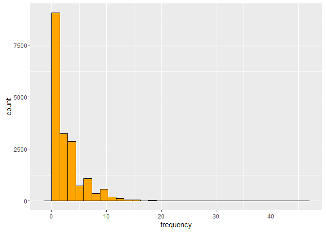
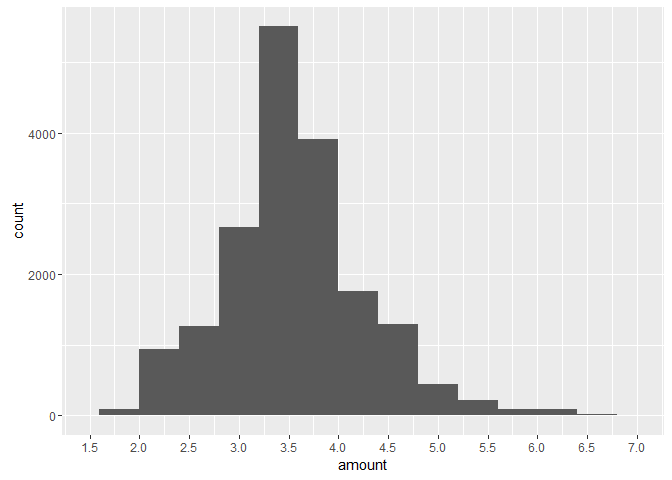
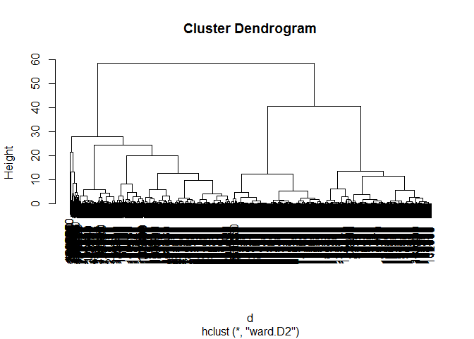

# Problem Set 1 - Statistical Segmentation
Nicolas  
April 19, 2016  

To validate Module 1 and correctly answer the questions will require that you perform the following exercise first: take the code in the file named module1.R, and modify it such that (1) the segmentation variable "frequency" is replaced by its log (before it is scaled), and (2) you select a 5-segment solution instead of a 9-segment solution.


### Loading the dataset

```r
data <- read.delim(file = 'purchases.txt', header = FALSE, sep = '\t', dec = '.')
```

### Transforming the dataset

Let's add headers and interpret the last column as a date, extract year of purchase

```r
colnames(data) <- c('customer_id', 'purchase_amount', 'date_of_purchase')
data$date_of_purchase <- as.Date(data$date_of_purchase, "%Y-%m-%d")
data$days_since       <- as.numeric(difftime(time1 = "2016-01-01",
                                            time2 = data$date_of_purchase,
                                            units = "days"))
```

### Exploring the transformed dataset

```r
head(data)
```

```
##   customer_id purchase_amount date_of_purchase days_since
## 1         760              25       2009-11-06  2246.9583
## 2         860              50       2012-09-28  1189.9583
## 3        1200             100       2005-10-25  3719.9583
## 4        1420              50       2009-07-09  2366.9583
## 5        1940              70       2013-01-25  1070.9583
## 6        1960              40       2013-10-29   793.9583
```

```r
summary(data)
```

```
##   customer_id     purchase_amount   date_of_purchase    
##  Min.   :    10   Min.   :   5.00   Min.   :2005-01-02  
##  1st Qu.: 57720   1st Qu.:  25.00   1st Qu.:2009-01-17  
##  Median :102440   Median :  30.00   Median :2011-11-23  
##  Mean   :108935   Mean   :  62.34   Mean   :2011-07-14  
##  3rd Qu.:160525   3rd Qu.:  60.00   3rd Qu.:2013-12-29  
##  Max.   :264200   Max.   :4500.00   Max.   :2015-12-31  
##    days_since      
##  Min.   :   0.958  
##  1st Qu.: 732.958  
##  Median :1499.958  
##  Mean   :1631.898  
##  3rd Qu.:2539.958  
##  Max.   :4015.958
```


### Computing key marketing indicators

Let's compute the Recency, Frequency and the Monetary Value (average purchase amount):

```r
library(dplyr)

customer_id_groups <- group_by(data, customer_id)     # first groups data by customer_id

customers <- summarise(customer_id_groups,  # then summarizes and creates new variables 
                       recency = min(days_since),     # number of days since last purchase
                       frequency = n(),                # number of purchases
                       amount = mean(purchase_amount))  # average purchase amount (monetary value)

head(customers)
```

```
## Source: local data frame [6 x 4]
## 
##   customer_id   recency frequency    amount
##         (int)     (dbl)     (int)     (dbl)
## 1          10 3828.9583         1  30.00000
## 2          80  342.9583         7  71.42857
## 3          90  757.9583        10 115.80000
## 4         120 1400.9583         1  20.00000
## 5         130 2969.9583         2  50.00000
## 6         160 2962.9583         2  30.00000
```

```r
summary(customers)
```

```
##   customer_id        recency           frequency          amount       
##  Min.   :    10   Min.   :   0.958   Min.   : 1.000   Min.   :   5.00  
##  1st Qu.: 81990   1st Qu.: 243.958   1st Qu.: 1.000   1st Qu.:  21.67  
##  Median :136430   Median :1069.958   Median : 2.000   Median :  30.00  
##  Mean   :137574   Mean   :1252.996   Mean   : 2.782   Mean   :  57.79  
##  3rd Qu.:195100   3rd Qu.:2129.958   3rd Qu.: 3.000   3rd Qu.:  50.00  
##  Max.   :264200   Max.   :4013.958   Max.   :45.000   Max.   :4500.00
```

### Doing more data exloration


```r
library(ggplot2)

ggplot(data=customers, aes(recency)) + geom_histogram(color = I('black'), fill= I('red3'))
```

```
## `stat_bin()` using `bins = 30`. Pick better value with `binwidth`.
```


```r
ggplot(data=customers, aes(frequency)) + geom_histogram(color = I('black'), fill= I('orange'))
```

```
## `stat_bin()` using `bins = 30`. Pick better value with `binwidth`.
```



```r
ggplot(data=customers, aes(amount)) + geom_histogram(binwidth = 10, color = I('black'), fill= I('deepskyblue')) +
   scale_x_continuous(limits = c(0, 500),
                     breaks = seq(0, 500, 20))
```

```
## Warning: Removed 167 rows containing non-finite values (stat_bin).
```

```
## Warning: Removed 2 rows containing missing values (geom_bar).
```


The frequency and monetary value distribution are skewed. The problem is not statistical, it's managerial. It requires data transformation (log).

***

## Preparing and transforming the dataset for hierarchical clustering


### Copying customer data into new data frame

```r
customers_transformed <- customers
```

### Removing customer id as a variable
And storing it as row names:

```r
row.names(customers_transformed) <- customers_transformed$customer_id
customers_transformed$customer_id <- NULL
head(customers_transformed)
```

```
## Source: local data frame [6 x 3]
## 
##     recency frequency    amount
##       (dbl)     (int)     (dbl)
## 1 3828.9583         1  30.00000
## 2  342.9583         7  71.42857
## 3  757.9583        10 115.80000
## 4 1400.9583         1  20.00000
## 5 2969.9583         2  50.00000
## 6 2962.9583         2  30.00000
```

### Taking the log-transform of the frequency

```r
customers_transformed$frequencylog <- log(customers_transformed$frequency)
customers_transformed$frequency <- NULL

# plot the log of the frequency
ggplot(data=customers_transformed, aes(frequencylog)) + geom_histogram() +
  scale_x_continuous(limits = c(0, 5),
                     breaks = seq(0, 5, 1))
```

```
## `stat_bin()` using `bins = 30`. Pick better value with `binwidth`.
```

```
## Warning: Removed 2 rows containing missing values (geom_bar).
```



### Standardizing variables

```r
customers_transformed <- scale(customers_transformed)      
# normalizes all elements of the dataframe such as 
# x <- (x - mu) / sigma
# now each variable has a mean = 0 and sigma = 1
# also allows to get rid of units ($, days...) 
# in order to better compare these variables together

head(customers_transformed) 
```

```
##        recency      amount frequencylog
## 10   2.3819788 -0.18005290  -0.85366742
## 80  -0.8415073  0.08833621   1.64194738
## 90  -0.4577590  0.37579019   2.09938025
## 120  0.1368198 -0.24483648  -0.85366742
## 130  1.5876660 -0.05048574   0.03528851
## 160  1.5811931 -0.18005290   0.03528851
```

Data is now ready to be segmented.

***

## Running a hierarchical segmentation

Here we want to compute the distances between customers: the closer two customers are, the sooner these two will be clustered together.

### Computing distance metrics on standardized data

```r
# d <- dist(customers_transformed)
```

This will likely generate an error on most machines because it requires too much memory (about 18k x 18k ~ 300 millions distance computation). Let's take a 10% (non-random) sample instead.

### Taking a 10% (non-random) sample on both standardized data and non-standardized data

```r
sample <- seq(1, nrow(customers), by = 10)   # keeps only one customer every 10 customers
head(sample)                           
```

```
## [1]  1 11 21 31 41 51
```

```r
customers_sample <- customers[sample, ]      # keeps only the rows defined by 'sample' seq
customers_transformed_sample <- customers_transformed[sample, ]
```

### Computing distance metrics on standardized data

```r
d <- dist(customers_transformed_sample)
```

### Performing hierarchical clustering on distance metrics

```r
c <- hclust(d, method="ward.D2")
plot(c)     # Plot the dendogram
```



### Cuting at 5 segments (ie. 5 clusters)

```r
members <- cutree(c, k = 5)
#rect.hclust(c, k=5, border="red")   # draw dendogram with red borders around the clusters
```

### Showing the 30 first customers and their corresponding segment number (1-5)

```r
members[1:30]
```

```
##   10  260  510  850 1040 1430 1860 2160 2380 2700 3000 3140 3650 3920 4240 
##    1    1    1    2    3    1    4    5    2    3    3    1    2    1    1 
## 4470 4710 4910 5230 5520 5710 5920 6080 6240 6410 6600 6750 6940 7100 7330 
##    2    2    3    3    1    1    5    3    3    3    1    2    2    3    1
```

### Showing the frequency table (number of customer in each segment)

```r
table(members)
```

```
## members
##   1   2   3   4   5 
## 542 187 584 481  48
```

### Showing the customer profiles in each segment 
In terms of recency, frequency and monetary value:

```r
aggregate(customers_sample[, 2:4], by = list(members), mean)
```

```
##   Group.1   recency frequency    amount
## 1       1 2626.5450  1.265683  32.58054
## 2       2  188.0546  9.502674  57.49499
## 3       3  820.7443  3.525685  43.01464
## 4       4  696.8440  1.000000  41.60707
## 5       5  997.8125  3.395833 489.00804
```

```r
# groups by segment number the variables (recency, frequency and monetary value) of the non-normalized customer sample and shows the mean value of each variable for each segment
```

***

## Questions

1/ What is the size of the largest segment?


```r
table(members)
```

```
## members
##   1   2   3   4   5 
## 542 187 584 481  48
```

The largest segment is segment #3, which has 584 customers.

2/ What is the average purchase amount of the segment which contains, on average, the customers who have made their last purchase the most recently?


```r
aggregate(customers_sample[, 2:4], by = list(members), mean)
```

```
##   Group.1   recency frequency    amount
## 1       1 2626.5450  1.265683  32.58054
## 2       2  188.0546  9.502674  57.49499
## 3       3  820.7443  3.525685  43.01464
## 4       4  696.8440  1.000000  41.60707
## 5       5  997.8125  3.395833 489.00804
```

The segment #2 has customers who made their last purchase 188 days ago on average.
For this segment, the average purchase amount is $57.5.

3/ What is the most relevant criteria to determine the best number of segments?

The most relevant criteria to determine the best number of segments is how managarially relevant your segmentation is. 
Additionally: The fact that each segment is clearly different from the other clusters.
The statistical validity of the segment solution, as determined by the dendogram

4/ Does customer #260 belongs to the same segment than customer #5920?


```r
members_mat <- as.matrix(members)
members_mat[c('260'), ]
```

```
## 260 
##   1
```

```r
members_mat[c('5920'), ]
```

```
## 5920 
##    5
```

No, customer #260 and customer #5920 don't belong to the same segment. 

5/ Looking at the average profile of segment 1, would you say that members of this segment are typically...


```r
aggregate(customers_sample[, 2:4], by = list(members), mean)
```

```
##   Group.1   recency frequency    amount
## 1       1 2626.5450  1.265683  32.58054
## 2       2  188.0546  9.502674  57.49499
## 3       3  820.7443  3.525685  43.01464
## 4       4  696.8440  1.000000  41.60707
## 5       5  997.8125  3.395833 489.00804
```

The member of segment #1 has an average recency of 2626 days (7.2 years) with an average frequency of about 1 and an average purchase amount of $32. It seems that the member of this segment were one-time shopper in this store and that it's unlikely that they will return. They are customers with poor prospects in terms of loyalty and profitability, due to the few purchases they have made so far.
